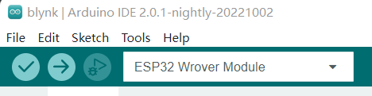
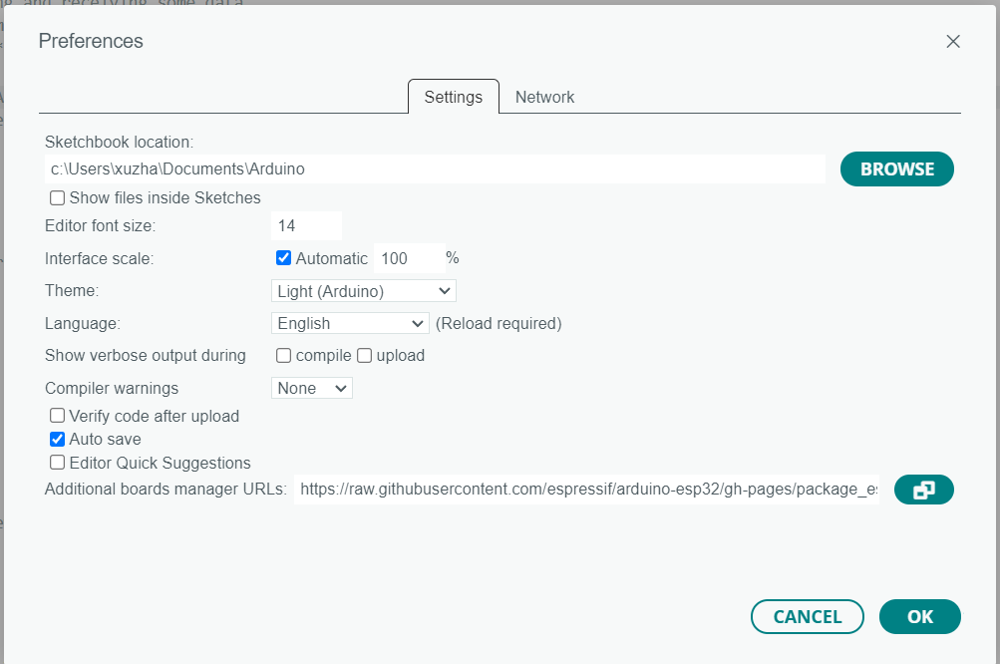
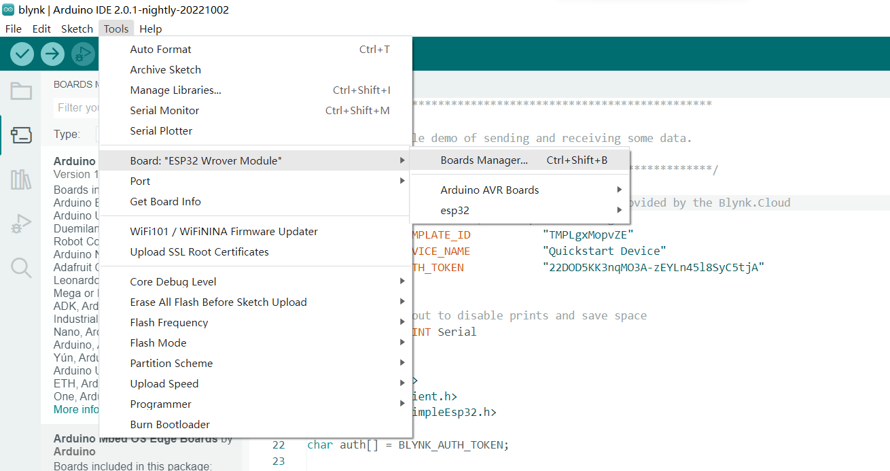

# ESP32CAM-project
It is a project that using ESP32CAM and object detection

**Create a new env**\
`conda create -n esp32 python==3.7`\
`conda activate esp32\`

**Git clone**\
`git clone https://github.com/AndyHUI711/ESP32CAM-project.git`

****Arduino set up**\**
1. download your Arduino IDE 2.0.0 from:
https://www.arduino.cc/en/software
2. install esp32 package\
\
Go to _File_ -> _Preferences_ -> enter: \
\
Add the Url:\
`https://raw.githubusercontent.com/espressif/arduino-esp32/gh-pages/package_esp32_index.json`\
3. install esp32 board lib \

_Tools -> Board Manager -> search esp32 -> download the last version_\

